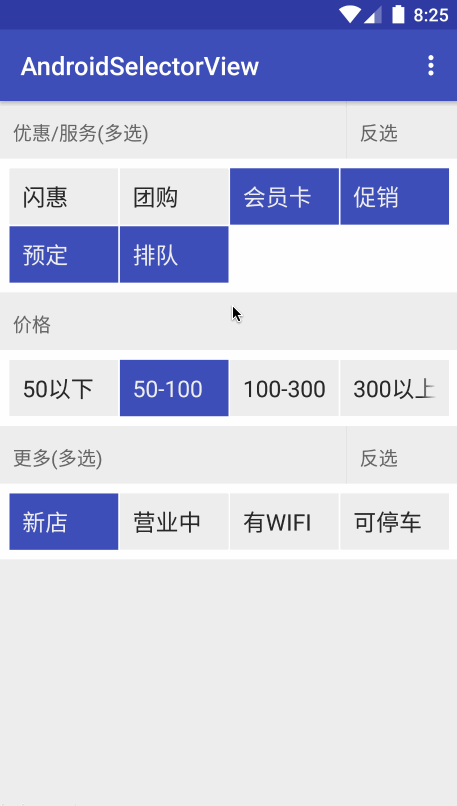

# Android Selector View

Selector View in Android supporting multiple choice and grouping.
Android中支持多选和分组的筛选控件

## Quick Overview

## Todo

 添加自定义属性  
 adapter 支持扩展  
 添加仿大众点评/饿了么筛选样式 
 发布到JCenter
 
## License

    Copyright 2016 isanwenyu@163.com

    Licensed under the Apache License, Version 2.0 (the "License");
    you may not use this file except in compliance with the License.
    You may obtain a copy of the License at

       http://www.apache.org/licenses/LICENSE-2.0

    Unless required by applicable law or agreed to in writing, software
    distributed under the License is distributed on an "AS IS" BASIS,
    WITHOUT WARRANTIES OR CONDITIONS OF ANY KIND, either express or implied.
    See the License for the specific language governing permissions and
    limitations under the License.
